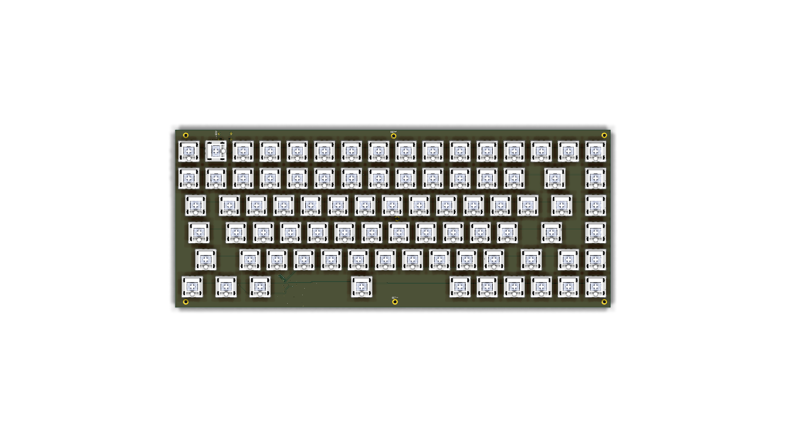
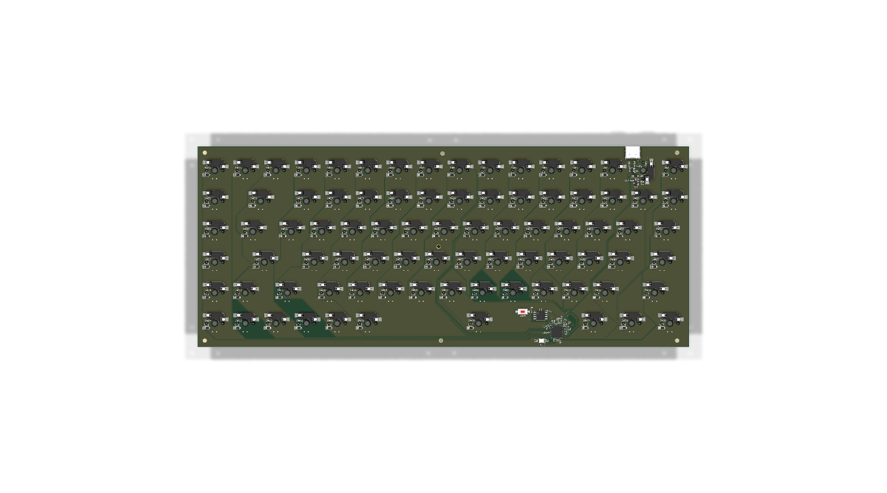

# KBoard

An 84-key custom mechanical keyboard built from scratch around the RP2040. No dev module: the RP2040, flash, regulator, USB-C, crystal, and support circuitry are all on the board, running QMK.

| Top | Bottom |
| --- | --- |
|  |  |

## Features
- 84 hot-swap MX-compatible switches in a ROW2COL matrix with per-key diodes
- From-scratch RP2040 design with USB-C, 16Mbit flash, and onboard 3.3V regulation
- QMK firmware with RP2040 USB bootloader (drag-and-drop UF2 flashing)

## Technical Details

The board is a 2-layer design (306 x 125 mm) with an RP2040 (QFN-56), W25Q16 flash, XC6206 LDO, USBLC6-2 ESD protection, a 12MHz crystal, 500mA polyfuse, and a mid-mount USB-C receptacle. One extra tact switch (SW85) is broken out for boot/reset.

## Bill of Materials

Full machine-readable list: [`BOM.csv`](BOM.csv)

| Item | Reference | Qty | Part | Notes |
| --- | --- | --- | --- | --- |
| 1 | U1 | 1 | RP2040 | QFN-56 microcontroller |
| 2 | U2 | 1 | W25Q16JVSS | 16Mbit SPI flash, SOIC-8 |
| 3 | U3 | 1 | XC6206 3.3V | LDO regulator, SOT-23-3 |
| 4 | U4 | 1 | USBLC6-2 | USB ESD protection, SOT-23-6 |
| 5 | Y1 | 1 | 12MHz crystal | 3225 SMD |
| 6 | J2 | 1 | USB4105-GF-A | USB-C mid-mount receptacle |
| 7 | F1 | 1 | Polyfuse 500mA | 0402 resettable fuse |
| 8 | R1-R2 | 2 | Resistor 1k | 0402 |
| 9 | R3-R4 | 2 | Resistor 27R | 0402, USB series termination |
| 10 | R5-R6 | 2 | Resistor 5.1k | 0402, USB-C CC pull-down |
| 11 | C1-C10 | 10 | Capacitor 0.1uF | 0402 decoupling |
| 12 | C11-C12 | 2 | Capacitor 15pF | 0402 crystal load |
| 13 | C13-C16 | 4 | Capacitor 1uF | 0603 |
| 14 | C17 | 1 | Capacitor 10uF | 0603 bulk |
| 15 | D1-D84 | 84 | 1N4148W | SOD-123 matrix diodes |
| 16 | SW1-SW84 | 84 | MX-style mechanical switch | Hot-swap, any MX compatible switch |
| 17 | SW85 | 1 | Tactile switch | Boot/reset |
| 18 | KC1-KC84 | 84 | 1u keycaps | Cherry MX profile |
| 19 | PCB1 | 1 | KBoard PCB | 2-layer, order from JLCPCB/PCBWay |

## Repo Index

### Start Here

| Path | Purpose |
| --- | --- |
| [`README.md`](README.md) | Project overview, features, bill of materials, and this repository map |
| [`BOM.csv`](BOM.csv) | Bill of materials |

### Hardware: KiCad

| Path | Purpose |
| --- | --- |
| [`kboard_pcb/KBoard.kicad_pro`](kboard_pcb/KBoard.kicad_pro) | KiCad project settings |
| [`kboard_pcb/KBoard.kicad_sch`](kboard_pcb/KBoard.kicad_sch) | Source schematic |
| [`kboard_pcb/KBoard.kicad_pcb`](kboard_pcb/KBoard.kicad_pcb) | Source PCB layout |

### Hardware: CAD Files

| Path | Purpose |
| --- | --- |
| [`CAD/KBoard.step`](CAD/KBoard.step) | 3D CAD model in STEP format |
| [`PCB/KBoard.step`](PCB/KBoard.step) | 3D CAD model in STEP format |
| [`PCB/KBoard.stl`](PCB/KBoard.stl) | 3D CAD model in STL format (local only, too large for git) |

### Hardware: Production Files

| Path | Purpose |
| --- | --- |
| [`production/KBoard-gerbers.zip`](production/KBoard-gerbers.zip) | Zipped Gerbers + drill, ready to upload to the fab |
| [`production/KBoard.step`](production/KBoard.step) | STEP model bundled for fabrication |
| [`production/gerbers/`](production/gerbers/) | Gerber plot, drill, and pick-and-place files |
| [`production/firmware/`](production/firmware/) | QMK firmware source and built UF2 for flashing |

### Hardware: Visual References

| Path | Purpose |
| --- | --- |
| [`assets/schematic.svg`](assets/schematic.svg) | Schematic preview |
| [`assets/pcb-top.png`](assets/pcb-top.png) | Top-side PCB render |
| [`assets/pcb-bottom.png`](assets/pcb-bottom.png) | Bottom-side PCB render |

### Firmware: QMK

| Path | Purpose |
| --- | --- |
| [`firmware/kboard/keyboard.json`](firmware/kboard/keyboard.json) | Keyboard identity, RP2040 target, pins, matrix, and layout |
| [`firmware/kboard/rules.mk`](firmware/kboard/rules.mk) | QMK build settings |
| [`firmware/kboard/config.h`](firmware/kboard/config.h) | Board configuration |
| [`firmware/kboard/kboard.h`](firmware/kboard/kboard.h) | Keyboard header included by QMK |
| [`firmware/kboard/keymaps/default/keymap.c`](firmware/kboard/keymaps/default/keymap.c) | Default keymap |

Build the firmware with `qmk compile -kb kboard -km default` (the `firmware/kboard` folder must be linked or copied to `qmk_firmware/keyboards/kboard`). Flash the resulting UF2, also bundled at [`production/firmware/kboard_default.uf2`](production/firmware/kboard_default.uf2), by double-pressing reset and dragging it onto the USB drive.
